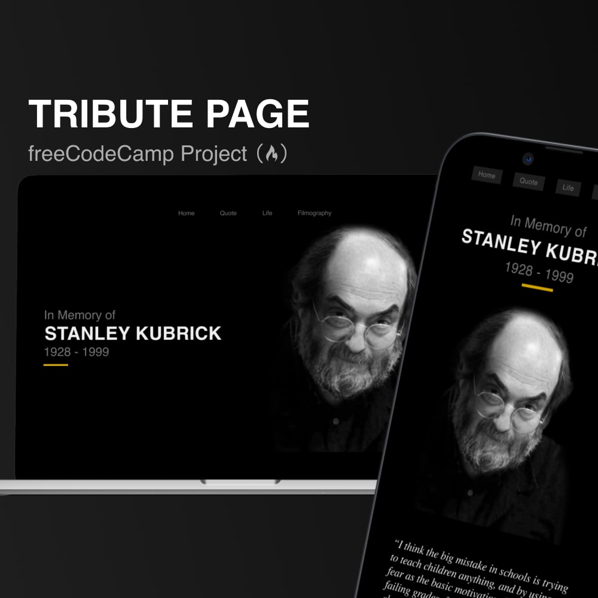

# Tribute Page - Stanley Kubrick

This is a tribute page designed for the freeCodeCamp project in memory of Stanley Kubrick fully responsive website, built using only HTML & CSS.

## Preview

## Contact

Email me at [contato@vvictin.com](mailto:contato@vvictin.com).

## License

This project is under **Public Domain**, anyone is free to copy, modify, publish, use, compile, sell, or distribute this software, either in source code form or as a compiled binary, for any purpose, commercial or non-commercial, and by any means.
